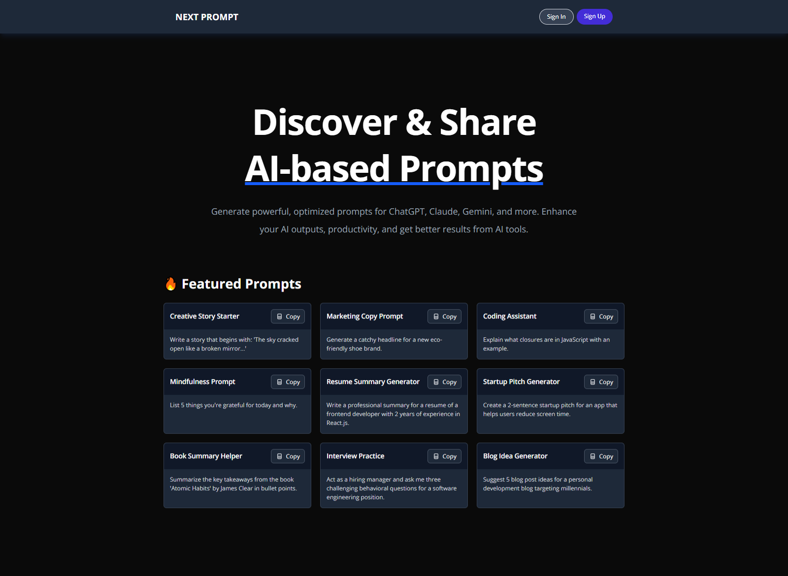

# Next Prompt ✨

A modern prompt-sharing application built with **Next.js**, **Supabase**, and
**Kinde** for authentication.

## 📷 Screenshot

## 🔧 Features

- 🔐 User Authentication with Kinde
- 🧠 Create, Read, and Share Prompts
- 🌙 Light & Dark mode support
- 📁 User Profile Page showing personal prompts
- 📋 Copy-to-clipboard functionality
- 🔄 Realtime data syncing (optional)

---

## 🚀 Tech Stack

- [Next.js 14](https://nextjs.org/)
- [Supabase](https://supabase.com/) (PostgreSQL + API + Auth)
- [Kinde](https://kinde.com/) (Auth-as-a-service)
- [Tailwind CSS](https://tailwindcss.com/)
- [Vercel](https://vercel.com/) (recommended for deployment)

---
